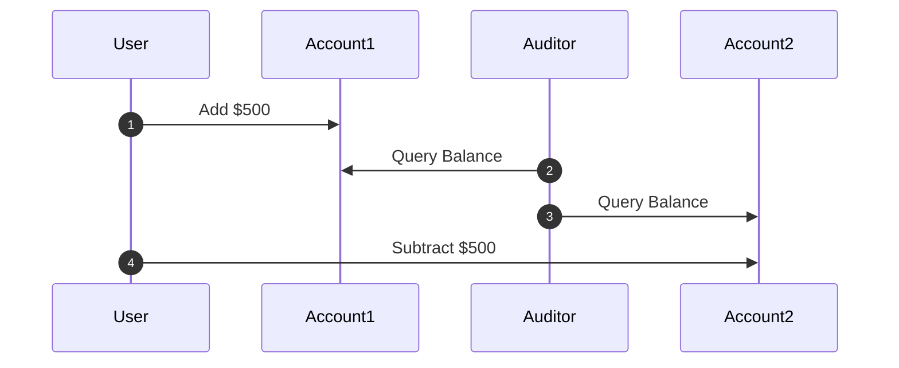

<h2 class="intro">What Math ✨ can bring to your daily toolbox of programming tools to write robust, concurrent programs: a light introduction to TLA+.</h2>

If you've been writing software for any amount of time, you may be familiar with the many tools we have available to us to ensure correctness, consistency and debuggability of our systems. They range the gamut of unit / acceptance / integration tests, QA plans, CI/CD automation and the like. System or language tools like type systems, interactive debuggers and profilers abound. Practices emerge like DevOps process, TDD/BDD, and even Agile process itself can be argued to be invented toward the goal of writing correct, robust, easy to maintain systems.

Surely these tools are advanced enough in the 70-plus years of computing to help! But no - with the rise of distributed computing, the classes of bugs that start to emerge start to get ornery and complex, are usually nondeterministic, and often beyond the reach of ordinary tools.

But what if I told you there was another option from the world of... *math*?

## Enter formal verification

What if there was a way to guarantee that our systems and algorithms are performant, run correctly, are reliable against race conditions and the like?

Here's how it works:

1. You describe your system (or program) in terms of formal logic statements. You assert specific conditions that must hold throughout the program runtime (invariants). You write this in the form of a proof (that lives outside your actual program).

2. The tool has a "model checker" which is a glorified BFS search algorithm that explores every possible state space of your program proof and lets you know if the invariant conditions hold.

3. If they do - congratulations! You've verified your system. If it doesn't pass - congratulations! You've found a potential bug!

4. Using the results from the model checker, you can fix the proof to fix the model checking error. This will translate into a real world fix that you can then roll back into your program.

It's not magical. It's also a lot of work, and in all fairness, slightly out of the reach of the typical industry programmer. But it's much more in reach than you think!

### A simple example

I'll be using a tool called TLA+, and writing a sample spec from a derivative syntax called PlusCal. I'll walk us through a simple example that can be found on the [Learn TLA web site](https://learntla.com/introduction/example/).

In the book *Designing Data-Intensive Applications*, the Transactions chapter illustrates a scenario where read isolation is not correctly implemented in the database, leading to *dirty reads* - simultaneous queries may be able to read dirty data from complex multi-statement operations - leading to bad outcomes.

Let's say we are a bank where a user attempts to transfer money between two accounts, and a separate query is being run by an auditor who wants to ensure that the bank software is working correctly and no funny money business is happening:



Alas, our system was implemented a bit naively, and we can see that the application makes two calls to the database, debiting from Account1 and crediting to Account2 in two separate statements. 

Assuming both accounts have initial values of $1000, the User's transfer completes successfully, transferring $500 from Account1 to Account2, maintaining the correct money flow (`Account1 + Account2 = $2000`).

However, the Auditor has had the unfortunate timing to look at the state of the world in between the two user operations and has a different view of the world, seeing that $500 has materialized out of thin air into Account 1 (`Account1 + Account2 = $2500`)!

Let's model this behavior as a TLA PlusCal algorithm:

```python
variables
  transfer_amount = 500,
  account1 = 1000,
  account2 = 1000;

process User = "user"
begin
  StartUserTransfer:
    account1 := account1 + transfer_amount;
  FinalizeUserTransfer:
    account2 := account2 - transfer_amount;
end process;

process Auditor = "auditor"
begin
  DoAudit:
    assert account1 + account2 = 2000
end process;
```

High level explanation - the two `process` blocks model two independent activities happening here - the user initiating the transfer and the auditor running the query.

This will blow up! The TLA model checker will compute all possible computation states between the two processes as delineated by the statements inside the `StartUserTransfer`, `FinalizeUserTransfer`, and `DoAudit` labeled statement groups, including when the auditor runs before, during, and after the user's inter-account transfer.


### How do we fix this?

Clearly, this is incorrect. We will need to ensure that the database is not able to allow other queries to read values happening from within a transaction. So here, we say "OK, we're going to wrap up these statements in a `TRANSACTION` block". But hold up! We need to move that change in system design into our TLA model.

Recall that the TLA model checker can only test state combinations *between each labeled state*, meaning that statements grouped inside a label are considered atomic operations. Knowing this, we move both transfers to within the same label to tell the model checker "these two operations happen at the same time, as if they were running in a transaction".

```python
begin
  DoUserTransfer:
    account_1 := account_1 + transfer_amount
    \* Collapse this transaction with the one above to make them atomic
    account_2 := account_2 - transfer_amount
```

Run the model checker again - it passes.

### More resources

This was a fairly high level overview on how to write TLA specs. This is much better [explained on the Learn TLA site](https://learntla.com/introduction/example/): please read more there!

For the sake of time, I will direct you to some great resources:

- [Learn TLA](https://learntla.com) - A beginner-friendly resource from author Hillel Wayne
- [Practical TLA+](https://link.springer.com/book/10.1007/978-1-4842-3829-5) - Hillel Wayne's more comprehensive resource for specification programming in TLA+
- [The TLA+ Home Page](https://lamport.azurewebsites.net/tla/tla.html) - Leslie Lamport (Author of TLA+)'s resources for learning and running specs written in TLA+

## Up next

I'd love to run through a real world example of using TLA+ to specify a distributed system, loosely based on a concurrency bug we saw recently at Lyft. Stay tuned!
