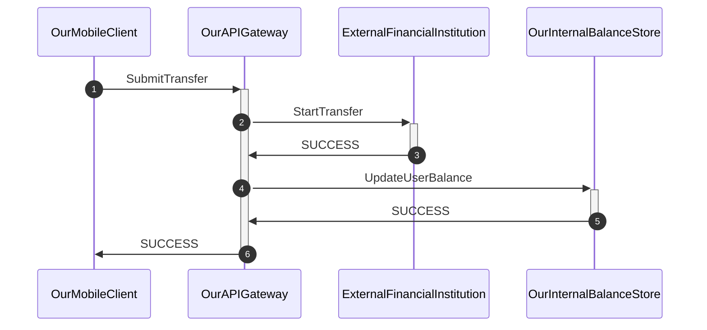
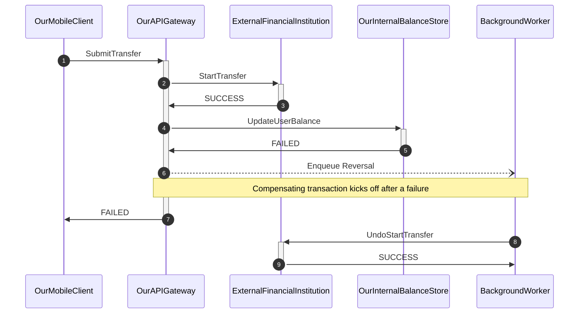
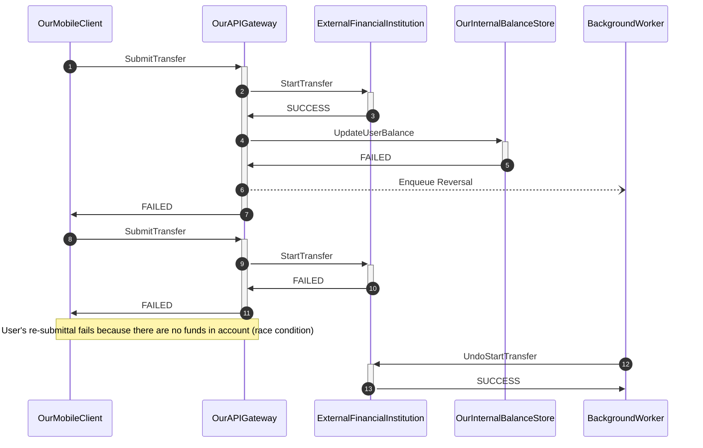

<h2 class="intro">In which we debug a production bug (loosely based on a real bug at Lyft) and check its fix in the TLA+ model checker!</h2>

In [Part 1]() we discussed the use cases for formal specifications and we looked at a simple transaction isolation bug in a financial institution. 

### Introduction

This is a distributed system transaction orchestration problem.

In this exercise, imagine we are a bank, and we are serving an API request from our banking mobile app to initiate a bank transfer from an external financial institution to the user's account.

 We are building a API endpoint that asks the other financial institution to move money over to us.
 
 The wrinkle here is that internally, the transfer also needs to be synchronized with a third, internal transaction database (our internal source of truth) to formally recognize the balance in the user's account.

 How do we design this system to ensure the design is resilient to failures and outages?
 

### Requirements:

- We must guarantee that balances are kept consistent between our system and the external institutions. No money should be lost/created on either side (obviously).
- The external service may fail to process the transaction for any reason (downtime, network partition, system error)
- The internal transaction service may also fail to process the transaction for any reason (antifraud rules, domain logic, ratelimiting, network partitions)
- The API request is synchronous, and must respond within 200ms @ p99

### The Happy Path

We illustrate the system design using the happy path. Our mobile client calls an API gateway, which we use as a transaction coordinator.

The API gateway makes 2 calls. First, it calls the external financial institution to initiate the transfer. If the transfer is successful, the API then turns around and pings the internal balance store service to note the transaction was a success.

(Note that this is not representative of a real world bank! This is a contrived, simplified example).

Because we need our API to be synchronous, the API coordinator blocks until both responses are success, before returning a success response to the client.



### Internal API error with compensating transaction

Of course, we know that errors can crop up in the real world. If the call to either service borks, we will need a way to either retry or fail gracefully. Here, we consider the use case where our internal API service crashes.

We consult with the team and decide that if the API service crashes for any reason, we will want to undo the transaction in the external financial institution with a compensating transaction. We will throw this work onto an external queue as soon as an error occurs.



But wait! We see that there's a bug. For there's a race condition when users "button mash" after they hit an error dialogue in the mobile client and immediately retry their request again!




This will fail.

## Enter formal specifications!

OK, let's try to model this behavior as a formal TLA+ spec. I'll write out how the spec would look, and we'll go through it line by line:

```python
variables
    queue = <<>>,
    reversal_in_progress = FALSE,
    transfer_amount = 5,
    button_mash_attempts = 0,
    external_balance = 10,
    internal_balance = 0;

define
    NeverOverdraft == external_balance >= 0
    EventuallyConsistentTransfer == <>[](external_balance + internal_balance = 10)
end define;

\* This models the API endpoint coordinator
fair process BankTransferAction = "BankTransferAction"
begin
    ExternalTransfer:
        external_balance := external_balance - transfer_amount;
    InternalTransfer:
        either
          internal_balance := internal_balance + transfer_amount;
        or
          \* Internal system error!
          \* Enqueue the compensating reversal transaction.
          queue := Append(queue, transfer_amount);
          reversal_in_progress := TRUE;

          \* The user is impatient! Their transfer must go through. They button mash (up to 3 times)..
          UserButtonMash: 
            if (button_mash_attempts < 3) then
                button_mash_attempts := button_mash_attempts + 1;

                \* Start from the top and do the external transfer
                goto ExternalTransfer;
            end if;
        end either;
end process;

\* This models an async task runner that will run a
\* a reversal compensating transaction. It uses
\* a queue to process work.
fair process ReversalWorker = "ReversalWorker"
variable balance_to_restore = 0;
begin
    DoReversal:
      while TRUE do
         await queue /= <<>>;
         balance_to_restore := Head(queue);
         queue := Tail(queue);
         external_balance := external_balance + balance_to_restore;
         reversal_in_progress := FALSE;
      end while;

end process;
```

Whew, ok! That's a lot. Let's go through it line by line:

First up, we declare variables and operators:

```python
\* These are global variables
variables
    queue = <<>>,
    transfer_amount = 5,
    button_mash_attempts = 0,
    external_balance = 10,
    internal_balance = 0;

define
    NeverOverdraft == external_balance >= 0
    EventuallyConsistentTransfer == <>[](external_balance + internal_balance = 10)
end define;
```

There are two main blocks here, the `variables` block and the `define` block. The variables defined here track values that will be used globally throughout the model. The operators in the `define` block are properties that the model checker will use to make sure invariants and temporal properties hold true throughout the lifecycle of the model.

It's imporant to note the properties defined here in the spec:

- `NoOverdrafts` is checked on every state combination, ensuring that there cannot be a scenario where the external financial institution is asked to transfer more money than is in its account.
- `EventuallyConsistentTransfer` is a *Temporal Property* that checks whether the system always eventually converges on the condition listed below - that external + internal balance equals $10, the starting amount. We are essentially guaranteeing that we cannot unintentially create or lose any money between our institutions.

Next up, there are two `process` blocks being defined here, representing the two internal systems whose interactions we are modeling here.

The first `process` is the API coordinator. Inside this coordinator, each action is marked by a `label` - so note the labels `ExternalTransfer`, `InternalTransfer`, and `UserButtonMash`. These correspond with various phases of our system sequence diagram. Let's walk through the code:

```python
fair process BankTransferAction = "BankTransferAction"
begin
    ExternalTransfer:
        external_balance := external_balance - transfer_amount;
        ...
```

This is fairly self-explanatory - the system is set up to first call the external institution and tell them to withdraw the money. **For simplicity's sake, we assume it always is successful**. (It obviously won't be, and we have the perfect tool to model failure scenarios around that!)

```python
 InternalTransfer:
        either
          internal_balance := internal_balance + transfer_amount;
        or
          \* Internal system error!
          \* The system will enqueue the compensating reversal transaction.
          queue := Append(queue, transfer_amount);
          reversal_in_progress := TRUE;
          ...
        end either;

```
The next label is interesting. We use an `either...or` control structure to tell the model checker that there is possibly branching logic here (in this case, there is a success case and a failure case). Both these branches will be exhaustively explored.

In the successful case, we observe that the internal API is called successfully and the balance is correctly stored. However, the failure case will have us enqueue a compensating transaction (a "reversal") that will be processed by an asynchronous worker.

```python
          \* The user is impatient! Their transfer must go through.
          \* They button mash (up to 3 times)....
          UserButtonMash: 
\*            await reversal_in_progress = FALSE;         
            if (button_mash_attempts < 3) then
                \* But the UI blocks them from re-submitting until the transaction
                \* has finished being reversed/compensated.
                button_mash_attempts := button_mash_attempts + 1;
     
                goto ExternalTransfer;
            end if;
```

Ooh, the user, the user. You can always count on the user to do something unexpected. So now while the user is enqueuing the compensating transaction, our poor user is confused and is now retrying the original transaction (aka "button mashing") the UI button in hopes that it will go through. Will it succeed?

Note that the way I've built the spec, I'm specifying a finite limit to the number of user retries, if only to make sure the program will eventually terminate.

Finally, observe the `goto ExternalTransfer` statement on Line 10. This basically tells the model checker to jump to the `ExternalTransfer:` label - i.e. the top of the program to re-execute the process all over again.

(Author's note: I haven't finished this yet, but thought I'd push this up as a work in progress. Do you see the error? Are your spidey senses tingling here? More to come!)
